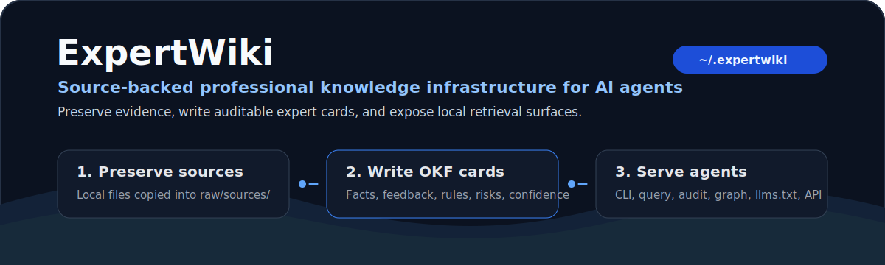

<div align="center">

# ExpertWiki

**A local-first expert encyclopedia and source-backed knowledge network for AI agents.**

ExpertWiki turns human-confirmed source material into structured Markdown
knowledge cards that agents can cite, audit, query, and package.

[Quick Start](#quick-start) · [Codex Skill](#codex-skill) · [CLI](#cli) · [Local API](#local-api) · [Architecture](docs/architecture.md) · [MVP](docs/mvp.md)

[](pyproject.toml)
[](pyproject.toml)
[](LICENSE)
[](skills/expertwiki/SKILL.md)



```text
Ask Codex:
Install PnakotusLabs/ExpertWiki from GitHub and turn this folder's admitted knowledge into ExpertWiki cards.
```

</div>

## Preview

ExpertWiki is not a generic note inbox. It is a source-preserving knowledge
bundle for the questions agents need to answer before they trust an expert
claim:

```text
human-confirmed files
  -> admission gate
  -> raw/sources/
  -> fast concept extraction + SQLite dependency graph
  -> heavy concept compilation + review queue
  -> approved wiki/{experts,projects,viewpoints,topics,comparisons,synthesis}
  -> query, audit, graph, llms.txt, local API, Codex Skill
```

<table>
  <tr>
    <td width="33%">
      <strong>Preserve evidence</strong><br />
      <sub>Accepted local files are copied into <code>raw/sources/</code> before synthesis.</sub>
    </td>
    <td width="33%">
      <strong>Write agent-readable cards</strong><br />
      <sub>Cards separate facts, human feedback, rules, risks, confidence, and sources.</sub>
    </td>
    <td width="33%">
      <strong>Expose retrieval surfaces</strong><br />
      <sub>Query Markdown cards locally, serve JSON, graph data, Markdown pages, and <code>llms.txt</code>.</sub>
    </td>
  </tr>
</table>

## Why ExpertWiki

Agent developers and AI application teams need stable professional knowledge
that is easier to inspect than a vector-store blob and more structured than a
folder of notes.

ExpertWiki focuses on provenance:

- who said what
- what evidence supports it
- when the source was updated or reviewed
- which credentials, conflicts, and context matter
- whether a claim is verified, stale, disputed, or based on a single case

The first wedge is global open-source AI, agent infrastructure, and developer
tooling. The same file contract can later support legal, medical, financial,
enterprise, and other expert domains.

## Typical Use Cases

- **Agent knowledge packs**: create local source-backed context bundles for
  coding agents, business agents, and workflow apps.
- **Expert and project directories**: model experts, projects, viewpoints,
  topics, comparisons, and synthesis pages in one Markdown bundle.
- **Human feedback mining**: extract decisions, review feedback, failures,
  real outcomes, and rules from local files.
- **Auditable local retrieval**: query only synthesized `wiki/` cards while
  keeping raw evidence available under `raw/sources/`.
- **Future ExpertContext API substrate**: prepare versioned context packages
  for MCP, hosted delivery, licensing, metering, and payout layers.

## Quick Start

### Requirements

- Python `>=3.9`
- `pytest` for development tests

### Install

```bash
python3 -m pip install -e .
```

If the `expertwiki` command is not on your `PATH`, run from source:

```bash
PYTHONPATH=src python3 -m expertwiki.cli --help
```

### Create a bundle

By default, ExpertWiki creates the user-level bundle at `~/.expertwiki`:

```bash
expertwiki init --title "Open Source AI Experts"
```

The bundle layout is:

```text
~/.expertwiki/
  AGENTS.md
  index.md
  log.md
  raw/
    sources/
  wiki/
    topics/
    entities/
      experts/
      projects/
    viewpoints/
    comparisons/
    synthesis/
  audits/
```

Use an explicit path when you want a project-local or team-local bundle:

```bash
expertwiki init ./my-expertwiki --title "Internal Engineering Experts"
```

### Add a source

Replace `<local-file>` with a real file on disk. The CLI does not fetch URLs.

```bash
expertwiki ingest ~/.expertwiki <local-file> \
  --publisher "GitHub" \
  --slug karpathy
```

### Compile with the invoking AI

When ExpertWiki is used as a Codex, Claude Code, Cursor, or similar skill, the
invoking AI is the default model. The CLI queues structured jobs in SQLite; the
skill reads each job's local inputs, generates strict JSON with its own model
capabilities, and submits the result for validation:

```bash
expertwiki add ~/.expertwiki <local-file> --publisher "Local notes"
expertwiki jobs next ~/.expertwiki --json
expertwiki jobs submit ~/.expertwiki <job-id> \
  --result <result.json> --generator codex --json
```

The skill repeats `jobs next` and `jobs submit` until the queue is empty, then
presents `.expertwiki/drafts/` for review. No model API key is required for this
host-AI path.

An OpenAI-compatible endpoint remains available for explicitly requested,
unattended compilation. Configure separate fast and heavy models:

```bash
export EXPERTWIKI_OPENAI_BASE_URL="http://127.0.0.1:11434/v1"
export EXPERTWIKI_FAST_MODEL="<fast-model>"
export EXPERTWIKI_HEAVY_MODEL="<heavy-model>"
export EXPERTWIKI_OPENAI_API_KEY="<key-if-required>"
```

Select it explicitly with `--backend api`:

```bash
expertwiki add ~/.expertwiki <local-file> --publisher "Local notes" --backend api
expertwiki review ~/.expertwiki
expertwiki approve ~/.expertwiki <draft-slug>
expertwiki ask ~/.expertwiki "What does the approved wiki say about this?" --backend api
```

For host-AI queue preparation without `add`:

```bash
expertwiki analyze ~/.expertwiki
expertwiki compile ~/.expertwiki
```

AI output never enters `wiki/` automatically. Compilation writes to
`.expertwiki/drafts/`; only `approve` publishes a page.

### Create a card

```bash
expertwiki page create ~/.expertwiki wiki/entities/experts/andrej-karpathy.md \
  --title "Andrej Karpathy" \
  --entity-type expert \
  --source karpathy
```

### Validate and query

```bash
expertwiki lint ~/.expertwiki
expertwiki audit ~/.expertwiki
expertwiki package ~/.expertwiki --dry-run
expertwiki query ~/.expertwiki "agent knowledge bundles"
```

## What It Can Manage

ExpertWiki uses Markdown as the source of truth.

Each bundle has:

- preserved raw source records
- expert pages
- project pages
- viewpoint pages
- topic pages
- comparison pages
- synthesis pages
- generated indexes
- update logs
- local audit reports

The CLI includes a local incremental LLM wiki compiler. Hosted retrieval, MCP service
deployment, expert claiming, licensing, usage metering, payout, and enterprise
distribution are future layers.

## Admission Gate

ExpertWiki should extract:

- human judgments, approvals, rejections, questions, and requested changes
- expert feedback from code review, design review, requirements review,
  incident review, testing, or launch feedback
- human edits to AI output, especially what changed and why
- real outcomes such as tests passing, production failures, accepted decisions,
  or rejected approaches
- decision rationale around security, performance, cost, compliance, UX,
  maintainability, or business goals
- failures, counterexamples, and contexts where advice does not apply

ExpertWiki should ignore:

- unconfirmed AI summaries
- context-free prompt tricks
- chat filler or pure emotion
- unsupported personal assertions
- duplicate templates and automatic logs
- conclusions whose source cannot be identified as human or AI
- success stories without basis, context, or outcome

## Codex Skill

This repository ships a Codex-compatible skill:

```text
skills/expertwiki/
  SKILL.md
  references/admission-gate.md
```

The packaged skill is:

```text
dist/expertwiki.skill
```

The skill teaches Codex to:

- use `~/.expertwiki` as the default bundle
- inspect source folders one file at a time
- apply the admission gate before ingestion
- reject URLs, directories, AI-only summaries, and unsupported claims
- preserve accepted local files under `raw/sources/`
- process SQLite analysis and compile jobs with Codex itself
- keep generated cards in review drafts until explicit human approval
- query only the synthesized `wiki/` layer

Install the skill into Codex by unpacking `dist/expertwiki.skill` into
`$CODEX_HOME/skills` or by using your Codex skill installer.

## CLI

```bash
expertwiki init [bundle] --title "<title>"
expertwiki status <bundle> --json
expertwiki ingest <bundle> <local-file> --publisher "<publisher>" --slug <slug>
expertwiki analyze <bundle> [--all]
expertwiki compile <bundle> [--concept <concept>] [--force]
expertwiki jobs next <bundle> --json
expertwiki jobs submit <bundle> <job-id> --result <result.json> --generator <host>
expertwiki jobs fail <bundle> <job-id> --error "<reason>"
expertwiki jobs retry <bundle> <job-id>
expertwiki jobs status <bundle> --json
expertwiki review <bundle>
expertwiki approve <bundle> <draft>
expertwiki reject <bundle> <draft> --feedback "<reason>"
expertwiki ask <bundle> "<question>"
expertwiki page create <bundle> wiki/<path>/<page>.md --title "<title>" \
  --entity-type <expert|project|viewpoint|topic|comparison|synthesis> \
  --source <source-ref>
expertwiki list <bundle> pages
expertwiki list <bundle> sources
expertwiki show <bundle> wiki/topics/<page>.md
expertwiki query <bundle> "<query>" --json
expertwiki index <bundle>
expertwiki lint <bundle>
expertwiki audit <bundle>
expertwiki package <bundle> --dry-run
```

Exit codes:

- `0`: success
- `1`: validation or preflight failure
- `2`: invalid CLI usage

## Knowledge Card Contract

Generated cards are ordinary Markdown files with YAML frontmatter:

```yaml
type: wiki_page
entity_type: expert
title: Example Expert
status: draft
quality: unreviewed
license: unknown
source_updated_at: unknown
last_reviewed_at: unknown
sources: [/raw/sources/example-source.md]
```

Recommended sections:

- `Context`
- `Facts`
- `Human Feedback`
- `Experience Rules`
- `Counterexamples and Risks`
- `Confidence`
- `Sources`

Use `quality` for lifecycle state:

- `unreviewed`
- `reviewed`
- `verified`
- `stale`
- `disputed`
- `rejected`

Use `confidence` in the body for evidentiary strength:

- `single_case`
- `multiple_confirmed`
- `verified`
- `stale`
- `disputed`

## Local Viewer

Open the read-only local viewer for pending drafts, approved pages, source-line
evidence, and the compiler knowledge graph:

```bash
expertwiki view ~/.expertwiki
```

When running from a source checkout:

```bash
PYTHONPATH=src python3 -m expertwiki.cli view ~/.expertwiki
```

The viewer listens on `http://127.0.0.1:8765` by default and opens it in the
browser. Use `--no-open` to start the server without opening a browser, or
`--port <port>` when 8765 is already in use. The viewer does not approve,
reject, edit, or otherwise mutate bundle content.

## Local API

Run the local HTTP reader against the example bundle:

```bash
PYTHONPATH=src python3 -m expertwiki.server \
  --data-dir bundles/expertwiki-ai-agent-engineering \
  --port 8765
```

Available endpoints:

```text
GET /health
GET /search?q=<query>&limit=10
GET /pages/<id>
GET /pages/<id>.md
GET /graph
GET /llms.txt
```

Example:

```bash
curl "http://127.0.0.1:8765/search?q=agent%20knowledge"
curl "http://127.0.0.1:8765/pages/entities/experts/andrej-karpathy"
curl "http://127.0.0.1:8765/pages/entities/experts/andrej-karpathy.md"
curl "http://127.0.0.1:8765/graph"
curl "http://127.0.0.1:8765/llms.txt"
```

## Example Bundle

The repository includes a seed vertical:

```text
bundles/expertwiki-ai-agent-engineering/
```

It contains raw source records and wiki cards for open-source AI, agent, and
developer-tool knowledge, including:

- an expert page for Andrej Karpathy
- project pages for Model Context Protocol and OpenAI File Search
- a viewpoint page for context as infrastructure
- a topic page for agent knowledge bundles
- a comparison page for knowledge cards and retrieval

Inspect it with:

```bash
PYTHONPATH=src python3 -m expertwiki.cli status bundles/expertwiki-ai-agent-engineering --json
PYTHONPATH=src python3 -m expertwiki.cli list bundles/expertwiki-ai-agent-engineering pages
PYTHONPATH=src python3 -m expertwiki.cli query bundles/expertwiki-ai-agent-engineering "MCP"
```

## Documentation

- [Architecture](docs/architecture.md) - bundle model, source records, page
  types, and local API
- [CLI Contract](docs/cli-contract.md) - command behavior, exit codes, and JSON
  usage
- [Codex Workflows](docs/codex-workflows.md) - agent operating workflows
- [MVP](docs/mvp.md) - product scope and launch sequence
- [Long-Term Principles](docs/long-term-principles.md) - durable design
  constraints
- [Wiki Page Quality Policy](docs/wiki-page-quality-policy.md) - quality and
  review standards

## Repository Layout

```text
AGENTS.md                         Agent instructions for this repository
README.md                         Project overview and usage
pyproject.toml                    Python package metadata and CLI entry point
src/expertwiki/                   CLI, authoring logic, linting, store, API
tests/                            Unit tests
docs/                             Architecture, MVP, CLI, and strategy notes
bundles/                          Example ExpertWiki bundles
skills/expertwiki/                Codex Skill source
dist/expertwiki.skill             Packaged Codex Skill
THIRD_PARTY_NOTICES.md            Third-party notices
```

## Development

```bash
python3 -m pytest
PYTHONPATH=src python3 -m expertwiki.cli lint bundles/expertwiki-ai-agent-engineering
PYTHONPATH=src python3 -m expertwiki.cli package bundles/expertwiki-ai-agent-engineering --dry-run
python3 "${CODEX_HOME:-$HOME/.codex}/skills/.system/skill-creator/scripts/quick_validate.py" skills/expertwiki
```

## Status And Safety

ExpertWiki is early local infrastructure. The file contract, CLI, local search,
linting, audit reports, graph export, `llms.txt`, and Codex Skill workflow are
implemented.

Use it locally first. Do not treat unreviewed cards as verified professional
advice. For regulated domains, keep source review, permissions, licensing,
freshness, and expert conflicts explicit.

## License

MIT
